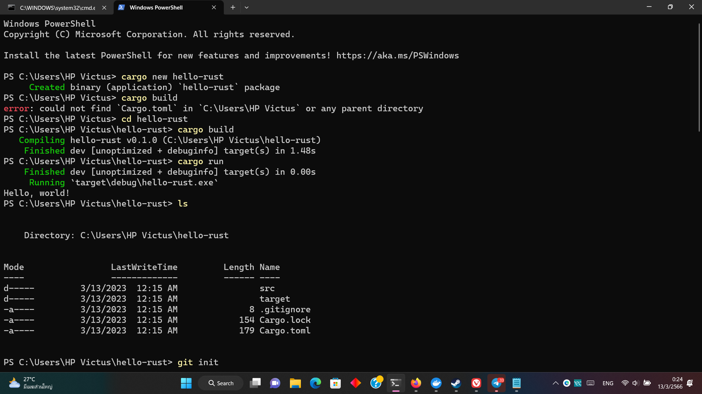

# About this repo
literally just the result from creating a new Rust project with
```
cargo new hello-rust
```

To build the project run
```
cargo build
```
And to run the project run
```
cargo run
```
Above commands are copied from [Rust's website](https://www.rust-lang.org/learn/get-started)
# Pictures

